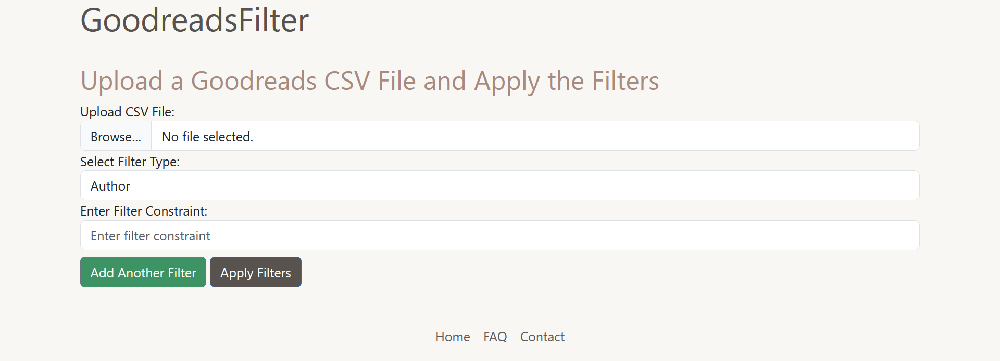

# GoodreadsFilter

 Filter exported GoodReads libraries by applying filters such as "Author", "date-added", "title", "year published", etc.

To expound upon that brief explanation, GoodreadsFilter allows you to filter the data associated with your Goodreads account by a specified filter (Author) and filter constraint (George R.R. Martin). Each filter is associated with a filter constraint and you are allowed to select multiple pairs when you choose to filter your Goodreads data.

You will need to [export your GoodReads library data](https://help.goodreads.com/s/article/How-do-I-import-or-export-my-books-1553870934590) to use this tool.

## Built With

 

## How to Use
[Export your  GoodReads library](https://help.goodreads.com/s/article/How-do-I-import-or-export-my-books-1553870934590) to a csv file and then:
- Upload your file to the website 
- Apply a filter(s) and filter constraint(s) to the file ("Author" with "George R.R. Martin", "date-added" with "2025/07/17" (YYYY-MM-DD), "title" with "Piranesi", "year published" with "2022", etc.) 
- Apply the filters and sift through the data

## Features
- [ ] Filter exported GoodReads libraries by applying filters such as:
    - [x] Author
    - [x] Author l-f
    - [x] Additional Authors
    - [x] ISBN13
    - [ ] My Rating
    - [ ] Average Rating
    - [x] Publisher
    - [x] Binding
    - [x] Number of Pages
    - [x] Year Published
    - [x] Original Publication Year
    - [x] Date Read
    - [x] Date added
    - [x] Bookshelves
    - [ ] Bookshelves with Positions
    - [ ] Exclusive Shelf
    - [ ] Spoiler
    - [ ] Private Notes
    - [x] Read Count
    - [x] Owned Copies

## Screenshots
### Homepage

## Project Roadmap
- [ ] Homepage
	- [ ] Filter exported GoodReads libraries by applying filters such as:
		- [x] Author
		- [x] Author l-f
		- [x] Additional Authors
		- [x] ISBN13
		- [ ] My Rating
		- [ ] Average Rating
		- [x] Publisher
		- [x] Binding
		- [x] Number of Pages
		- [x] Year Published
		- [x] Original Publication Year
		- [x] Date Read
		- [x] Date added
		- [x] Bookshelves
		- [ ] Bookshelves with Positions
		- [ ] Exclusive Shelf
		- [ ] Spoiler
		- [ ] Private Notes
		- [x] Read Count
		- [x] Owned Copies
- [x] FAQ/Contact Page
- [x] User Sessions

## License
Distributed under the GNU GPLv3 License. See the "COPYING" file for more information.
